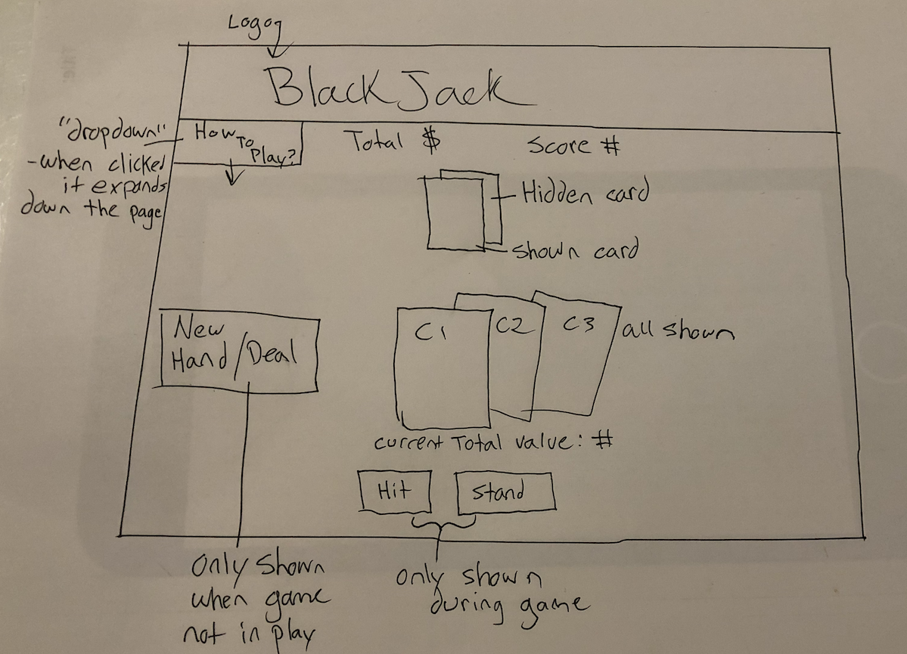
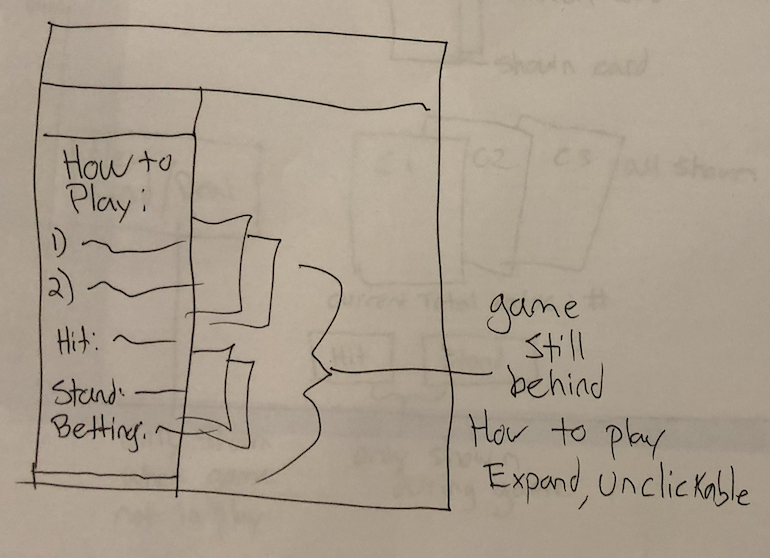
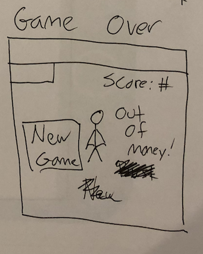
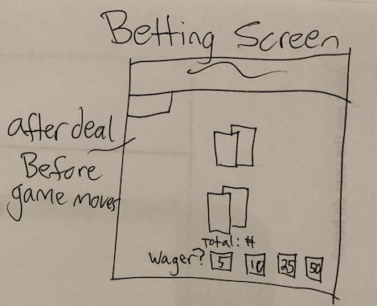

<!-- A working title for your app
Description .4-5 sentences summarizing the functionality of your app. Feel free to include what problem is your app solving.
Wireframes Wireframes showing your app's layout on desktop, tablet, and mobile. These can be as lo-fi or as hi-fi as you want. You can either to put these in the README or upload them to your repository.
API What API you want to use and what information you want to get from it. *You must show us a sample of actual data you retrieved from your API.
Features Write out what features you will need to build in order to meet MVP.
Stretch goals Stretch goals for additional / advanced features for when you complete your MVP. -->

<h2>Blackjack!</h2>

--  a blackjack game by nolan giles
#
<strong>Description:</strong>
- A blackjack card game using the deck of cards API.  It should allow the user to play multiple games of Blackjack potentially against a computer resulting in a win/loss state.  The player will be able to have a money value total they can use to bet on each hand.  The money value will be carried over with the objective to gain as much as you can, if you hit 0 dollars you lose.
#
<strong>Wireframes:</strong>




#


<strong>API:</strong>
- This will be using the Deck of cards API located at: [Deck of cards](https://deckofcardsapi.com/)
- A deck will be received via the axios GET call with:
https://deckofcardsapi.com/api/deck/new/
as the parameter. This will return a new deck object with a deck_id:
```
{
  shuffled: true,
  deck_id: "v0c4lrqe3wr2",
  remaining: 52,
  success: true
}
```
- This deck_id value can then be used to shuffle & draw cards from the deck held by the API.
- For example if I wanted to grab the entire deck I could do the call:
```
https://deckofcardsapi.com/api/deck/v0c4lrqe3wr2/draw/?count=52
```
- and the result of that looks like: (truncated with the example changed to 2 cards)
```
{
deck_id: "v0c4lrqe3wr2",
remaining: 50,
cards: [
{
images: {
png: "https://deckofcardsapi.com/static/img/2S.png",
svg: "https://deckofcardsapi.com/static/img/2S.svg"
},
suit: "SPADES",
value: "2",
code: "2S",
image: "https://deckofcardsapi.com/static/img/2S.png"
},
{
images: {
png: "https://deckofcardsapi.com/static/img/QC.png",
svg: "https://deckofcardsapi.com/static/img/QC.svg"
},
suit: "CLUBS",
value: "QUEEN",
code: "QC",
image: "https://deckofcardsapi.com/static/img/QC.png"
}
],
success: true
}
```
#
<strong>Example of card image:</strong>


#
<strong>MVP Features:</strong>
- CSS animated logo / Or graphic logo in the header
- Win % tracker
- Betting function with $ value persisting over multiple games
- The blackjack game itself displayed on screen with card images from API will consist with basic blackjack rule features such as:
-- standing
-- hitting
-- doubling
The game will check if player is under/over 21, if over player will bust. If under and player stands player's final total will be pit against a "DEALER'S" hand's final value., if higher or equal to the dealer's hand and under 21 player wins. If lower, player loses.
-Reset game button
-Deal button that should only be visible once current hand is over.
-A game over if player runs out of money
-A how to play/rules section
#
<strong>Stretch Features:</strong>
- Showing the dealer's hand on screen as well
- Keeping persistent stats over multiple sessions
- If stats are kept, maybe players name can be saved?
- Other BJ features such as splitting / surrendering / insurance
- Better CSS animations for cards dealing, flipping and winning.
- An animated event for running out of money
- More complicated betting features, perhaps different types of payouts given different situations.
- Avatar/icons?
- Sounds?
- More complex ai thinking
- Different variations of blackjack implemented, such as progressive blackjack.
- A 2-player pass-back-and-forth feature (not-online)